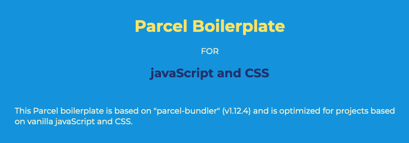

# Parcel boilerplate



After clone or download go to root folder and in terminal run:

**Yarn**

```bash
yarn install
```

**npm**

```bash
npm i
```

to install node_modules

---

## Used packages

---

### Parcel - `bundler`

[Parcel JS](https://parceljs.org/)

installed package : **parcel-bundler**
config file: **.prettierrc**

---

### Prettier - `format code`

[Prettier](https://prettier.io/)

installed package : **prettier**

**NOTE**: in VS Code settings set these conditions:
**Editor**: format on save => true
**Prettier**: require config => true

Then create `.prettierrc`. Empty brackets inside this file will initiate basic formatting setup. You can specify your preferable rules for prettier inside this brackets.

**ATTENTION**: from now on Prettier will format files ONLY if project will have `.prettierrc` file in root folder. If you want back VS Code standard behavior, set in setting **Prettier**: require config => false.

---

### ESlint

installed package : **eslint** | **eslint-config-prettier**
config file: **.eslintrc**

ESlint analyze possible problems in code. We don't need to run `yarn lint` command because linter will show problems automatically. We can run

[ESlint](https://eslint.org/)

[ESlint config](https://eslint.org/docs/user-guide/configuring)

If you use `VS Code` you can install [`ESLint` extension](https://github.com/Microsoft/vscode-eslint)

_TODO: parserOptions revision_

```json

    "ecmaFeatures": {
      "templateStrings": true,
      "arrowFunctions": true,
      "spread": true,
      "restParams": true,
      "defaultParams": true,
      "forOf": true
    }
```

### eslint-config-prettier

[eslint-config-prettier](https://github.com/prettier/eslint-config-prettier)

As ESlint will try to fix code formatting this extension turn off all rules that are unnecessary or might conflict with `Prettier` that we have already installed for code formatting.

---

### rimraf - `rm -rf for node`

[rimraf](https://github.com/isaacs/rimraf)

---

### Browserlist

With build will Parcel transpile your code to support ALL browsers include IE_11. If we want to target only modern browsers we can use `browserlist`. With this toll Parcel will transpile our app code work seamlessly with specific range of browsers versions. It is always recommended to get research what versions is mainly used by our targeted audience. Here Im using standard `last 2 versions` of each browser.

[browserl.ist](https://browserl.ist/?q=)

[browserlist](https://github.com/browserslist/browserslist)

---

### BabelJS

[babelJS](https://babeljs.io)\
[core](https://babeljs.io/docs/en/babel-core)\
[proposal-class-properties](https://babeljs.io/docs/en/babel-plugin-proposal-class-properties#with-a-configuration-file-recommended)\
[preset-env](https://babeljs.io/docs/en/babel-preset-env)\
[babel-eslint](https://github.com/babel/babel-eslint)

---

## OPTIONS

### cross-env

[cross-env](https://github.com/kentcdodds/cross-env)

```json
"dev:mock": "cross-env SOMETHING_MOCK=mock parcel public/index.html"
```

```bash
yarn dev:mock
```

```bash
npm run dev:mock
```

<!-- TODO: check text later -->

`mock` will never hit API and will work in offline mode. It will return list of random things.

### Emotion

Emotion is a library designed for writing css styles with JavaScript. It provides powerful and predictable style composition in addition to a great developer experience with features such as source maps, labels, and testing utilities. Both string and object styles are supported.

[emotions](https://emotion.sh/docs/introduction)

### BarbaJS

[BarbaJS](https://barba.js.org/docs/getstarted/intro/)

**BarbaJS** is a small (7kb minified and compressed) and easy-to-use library that helps you create fluid and smooth transitions between your website’s pages. It makes your website run like a _SPA_ (Single Page Application) and help reduce the delay between your pages, minimize browser HTTP requests and enhance your user’s web experience.

**BarbaJS** can be used as [router](https://barba.js.org/docs/plugins/router/) ;)
